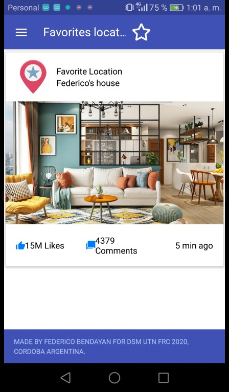

# SharePlaces

Disclaimer: the app was made only for educational purposes,
using the React native framework and other tools to make
multiple platform mobile Apps. Git Commits are
meant to keep track of the struggles and problems faced during
development.

 
<strong>The app uses:</strong>
<ul>
<li>:white_check_mark: native-base (styling)</li>
<li>:white_check_mark: react-native-router-flux (navigation)</li>
<li>:white_check_mark: axios (request processor library)</li>
  <li>:white_check_mark: randomuser.me (to get random users)</li>
  
</ul>

<strong>The app not uses due to integrations packages problems (but it used to):</strong>
<ul>
<li>:x: Google maps API.</li>
<li>:x: Airbnb maps module (react-native-maps & react-native-geolocation-service)</li>
<li>:x: Fire base as backend (real time database, to store gps coordinates).</li>
</ul>

 
<strong>Tested on:</strong>
<ul>
<li>:white_check_mark:Android emulator</li>
<li>:white_check_mark:Real android device (personal cellphone, conected to pc)</li>
<li>:x:Real IOS device (Comming soon...)</li>
</ul>
 
<strong>Sample picture:</strong>

 

<strong>available Features:</strong>
<ol>
<li>:ballot_box_with_check:Get user locations: Navigation
</li>
<li>:ballot_box_with_check: Home page</li>
  <li>:ballot_box_with_check: Favorites page</li>
    <li>:ballot_box_with_check: Friends page</li>
  <li>:ballot_box_with_check: Friends details page</li>
</ol>

<strong>Unavailable Features:</strong>
<ol>
<li>:x: Get user locations: Pulls from backend stored coordinates
of other users and marks them on a map.
</li>
<li>:x: Get user location: marks on the map
the current user location (needs location permission
on the device)</li>
</ol>
